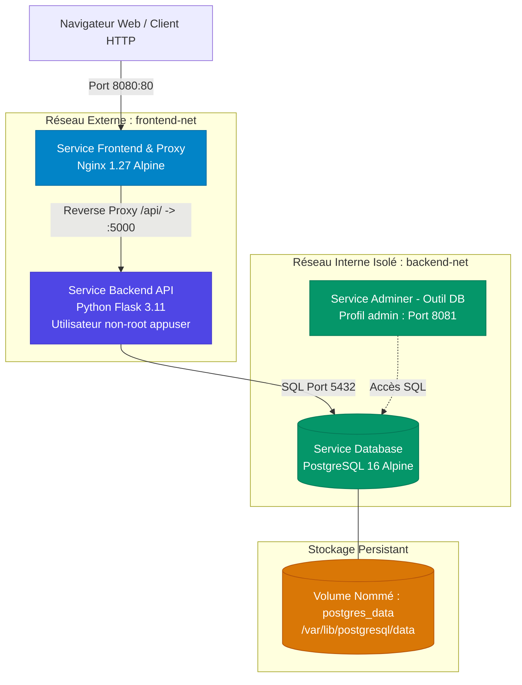

# 🐳 CloudAsset Manager — Virtualisation d'une Application avec Conteneurs

[](https://github.com/Keyshi9/Kodjo-Selle-ProjetDocker/actions)


---

## 📌 Informations Générales
* **Établissement** : Centre professionnel du Nord vaudois (CPNV)
* **Formation** : FPA 2ème année (SI-CA2a)
* **Module** : **I347 — Utiliser un service avec des conteneurs**
* **Projet** : Virtualisation d’une application multi-services avec Docker & Docker Compose
* **Binôme / Trinôme** : **Kodjo & Selle**
* **Enseignant** : YKE (GitHub : [`koyaob`](https://github.com/koyaob))
* **Sujet attribué** : **Sujet n°10 — Publication d'une image sur Docker Hub**
* **Image Docker Hub officielle** : [`keyshi9/i347-flask-inventory-api:1.0.0`](https://hub.docker.com/r/keyshi9/i347-flask-inventory-api)

---

## 1. 📖 Introduction & But du Projet

Dans le cadre d'un besoin de modernisation d'infrastructure applicative, ce projet conçoit, conteneurise et déploie une solution complète de **gestion d'inventaire d'équipements informatiques et conteneurs (CloudAsset Manager)**.

L'objectif principal est de fournir une architecture micro-services robuste, sécurisée, reproductible et documentée, répondant aux exigences strictes du cahier des charges :
1. Orchestration déclarative via **Docker Compose** avec 3 services distincts interconnectés.
2. Conception d'un **Dockerfile multi-stage** optimisé et sécurisé (utilisateur non-root).
3. **Persistance des données** garantie via des volumes Docker nommés.
4. **Cloisonnement réseau** et gestion étanche des secrets applicatifs.
5. Automatisation de la qualité : tests fonctionnels, validation de persistance et **pipeline CI/CD GitHub Actions**.
6. **Publication de l'image applicative sur Docker Hub** avec validation du cycle `build -> tag -> push -> pull` (Sujet 10).

---

## 2. 🏛️ Architecture Technique & Schémas

L'application est composée de trois conteneurs principaux fonctionnant de concert, avec un quatrième conteneur optionnel d'administration :

```
                                [ Client / Navigateur ]
                                           │
                                    Port 8080 (HTTP)
                                           ▼
                    ┌──────────────────────────────────────────────┐
                    │               i347-frontend                  │
                    │        Nginx 1.27 (Alpine) + Static Web      │
                    └──────────────────────┬───────────────────────┘
                                           │
                                   frontend-net (Bridge)
                                           │
                                           ▼
                    ┌──────────────────────────────────────────────┐
                    │                i347-backend                  │
                    │   Flask API (Multi-Stage / USER non-root)    │
                    │     Image : keyshi9/i347-flask-inventory-api │
                    └──────────────────────┬───────────────────────┘
                                           │
                                   backend-net (Isolé)
                                           │
                                           ▼
                    ┌──────────────────────────────────────────────┐
                    │               i347-database                  │
                    │           PostgreSQL 16 (Alpine)             │
                    └──────────────────────┬───────────────────────┘
                                           │
                                           ▼
                                 [ Volume persistant ]
                                  (postgres_data)
```

### Diagramme Mermaid de l'Architecture Réseau & Données



### Description des 3 Services Interconnectés

| Service | Image & Base | Rôle & Fonctionnalités | Ports exposés | Réseaux |
| :--- | :--- | :--- | :--- | :--- |
| **`frontend`** | `nginx:1.27-alpine` | Serveur web statique (UI Glassmorphism) + **Reverse Proxy** pour router `/api/` vers le backend. Ajoute les en-têtes HTTP de sécurité. | `8080:80` (Hôte) | `frontend-net` |
| **`backend`** | `keyshi9/i347-flask-inventory-api:1.0.0` | API REST Flask exécutée avec **Gunicorn** (production). Gère les endpoints `/api/health`, `/api/info`, `/api/assets` et `/api/stats`. | Aucun port externe direct | `frontend-net`, `backend-net` |
| **`database`** | `postgres:16-alpine` | Base de données relationnelle PostgreSQL. Initialisée via `database/init.sql`. | Aucun port externe (protégée) | `backend-net` |
| **`adminer`** *(Optionnel)* | `adminer:4-standalone` | Interface web d'administration de la BDD pour la démonstration orale (activable via profil `admin`). | `8081:8080` | `backend-net` |

---

## 3. 🚀 Instructions de Lancement

### Prérequis
* [Docker Desktop](https://www.docker.com/products/docker-desktop/) installé et démarré (avec Docker Compose v2+).
* Git installé.

### Démarrage en une seule commande

```bash
# 1. Cloner le projet
git clone https://github.com/Keyshi9/Kodjo-Selle-ProjetDocker.git
cd Kodjo-Selle-ProjetDocker

# 2. Configurer les variables d'environnement (si besoin d'ajustements)
cp .env.example .env

# 3. Construire et démarrer l'ensemble des conteneurs
docker compose up -d --build
```

### Accès aux applications
* 🌐 **Interface Web Principale (Frontend)** : [http://localhost:8080](http://localhost:8080)
* 🩺 **Healthcheck de l'API** : [http://localhost:8080/api/health](http://localhost:8080/api/health)
* ℹ️ **Métadonnées de l'architecture** : [http://localhost:8080/api/info](http://localhost:8080/api/info)
* 📊 **Statistiques du parc** : [http://localhost:8080/api/stats](http://localhost:8080/api/stats)

### Démarrage avec l'outil d'administration (Profil Démonstration)
Pour démarrer également **Adminer** pour la soutenance orale :
```bash
docker compose --profile admin up -d
```
Accessible ensuite sur [http://localhost:8081](http://localhost:8081) *(Serveur: `database`, Utilisateur: `appuser`, Mot de passe: `secure_postgres_pass_2026`, Base: `inventory_db`)*.

### Arrêt des services
```bash
# Arrêt simple (conserve les volumes et les données)
docker compose down

# Arrêt complet avec suppression des volumes
docker compose down -v
```

---

## 4. 🔒 Sécurité, Réseau et Persistance

### A. Sécurité de l'image (Dockerfile Multi-Stage & Droits Réduits)
Le `backend/Dockerfile` a été optimisé selon les règles de l'art :
* **Multi-stage build** : L'étape de compilation (`builder`) installe les compilateurs (`gcc`, `libpq-dev`), puis seule l'arborescence compilée est transférée vers l'étape finale (`runner`). L'image finale ne contient aucun outil de build inutile.
* **Taille minimale** : Utilisation de `python:3.11-slim`, sans cache pip (`--no-cache-dir`) et purge des listes APT (`rm -rf /var/lib/apt/lists/*`).
* **Utilisateur non-root (`appuser`)** : Par défaut, les conteneurs Docker tournent sous `root`. Pour respecter le principe du moindre privilège, un utilisateur dédié UID `10001` est créé et actif (`USER appuser`). Même en cas de vulnérabilité applicative, l'attaquant ne dispose pas des privilèges système.
* **Serveur de production WSGI** : L'API n'utilise pas le serveur de développement intégré de Flask mais le serveur multi-processus durci **Gunicorn**.
* **Healthcheck natif** : Surveillance périodique de l'intégrité du service directement dans Docker (`HEALTHCHECK`).

### B. Cloisonnement Réseau (Isolation)
Deux réseaux Docker personnalisés de type `bridge` sont mis en place :
1. `frontend-net` : Permet au proxy Nginx de communiquer avec l'API Flask.
2. `backend-net` : Permet à l'API Flask de communiquer avec PostgreSQL.

> [!IMPORTANT]
> **La base de données n'a aucun port mappé sur la machine hôte**. Elle est totalement invisible depuis l'extérieur et ne communique qu'avec le conteneur backend via `backend-net`. Même si le frontend était compromis, la base de données ne lui est pas accessible directement.

### C. Gestion des Secrets & Variables (`.env`)
* Le fichier `.env.example` fournit le modèle des configurations sans exposer de secrets sensibles.
* Le fichier réel `.env` est exclu du contrôle de version via `.gitignore`.
* Les variables sont injectées dynamiquement au lancement des conteneurs via Docker Compose.

### D. Stratégie de Persistance des Données
* Les données de PostgreSQL sont montées sur un **volume Docker nommé** : `postgres_data:/var/lib/postgresql/data`.
* **Justification** : Contrairement aux montages de type *bind mount*, un volume Docker est géré directement par le moteur Docker, indépendant du cycle de vie des conteneurs, hautement performant sous Windows/Linux et préservé lors d'un `docker compose down` ou d'une mise à jour d'image.

---

## 5. 📦 Publication sur Docker Hub (Conformité Sujet n°10)

Le sujet n°10 impose la construction, le taguage, la publication et la vérification du téléchargement de l'image sur Docker Hub.

### Détails de l'image publiée
* **Registre** : Docker Hub
* **Nom du dépôt** : [`keyshi9/i347-flask-inventory-api`](https://hub.docker.com/r/keyshi9/i347-flask-inventory-api)
* **Tags disponibles** : `1.0.0` et `latest`

### Commandes manuelles de publication
```bash
# 1. Connexion au compte Docker Hub
docker login

# 2. Construction et taguage de l'image multi-stage
docker build -t keyshi9/i347-flask-inventory-api:1.0.0 -t keyshi9/i347-flask-inventory-api:latest ./backend

# 3. Publication sur le registre distant
docker push keyshi9/i347-flask-inventory-api:1.0.0
docker push keyshi9/i347-flask-inventory-api:latest
```

### Script automatisé de publication
Des scripts prêts à l'emploi sont fournis pour exécuter cette opération en une commande :
* **Windows (PowerShell)** : `.\scripts\publish_dockerhub.ps1`
* **Linux / Bash** : `./scripts/publish_dockerhub.sh`

### Test du `docker pull` (Validation sur une autre machine)
Pour prouver que l'image est opérationnelle depuis n'importe quel poste distant :
```bash
docker pull keyshi9/i347-flask-inventory-api:1.0.0
docker run -d -p 5000:5000 --name test-pull keyshi9/i347-flask-inventory-api:1.0.0
curl http://localhost:5000/
docker stop test-pull && docker rm test-pull
```

---

## 6. 🧪 Tests Automatisés & Résultats

### Exécution locale des tests
Des scripts de tests automatisés vérifient le linter, le démarrage, les endpoints CRUD de l'API et la persistance des volumes :

* **Sous Windows (PowerShell)** :
  ```powershell
  .\scripts\run_tests.ps1
  ```
* **Sous Linux / macOS / WSL** :
  ```bash
  chmod +x ./scripts/*.sh
  ./scripts/run_tests.sh
  ```
* **Test unitaire Python direct** :
  ```bash
  python tests/test_api.py
  ```

### Scénario du Test de Persistance Automatisé
1. Insertion d'un actif (`srv-test-volume-persist`) dans PostgreSQL via l'API.
2. Arrêt forcé et redémarrage du conteneur de base de données : `docker compose restart database`.
3. Ré-interrogation de l'API : l'actif est immédiatement retrouvé, prouvant que le volume Docker `postgres_data` conserve l'état des données indépendamment du conteneur.

### Pipeline CI/CD GitHub Actions (`.github/workflows/ci.yml`)
À chaque `git push` ou `Pull Request` sur GitHub, le pipeline exécute automatiquement :
1. **Linting** : Contrôle du code Python avec `flake8`.
2. **Build Docker Compose** : Validation de la syntaxe et build des images.
3. **Tests d'intégration** : Démarrage des conteneurs et exécution de `tests/test_api.py`.
4. **Test de persistance** : Simulation de crash/redémarrage du conteneur DB.
5. **Publication conteneur** : Déploiement automatique sur le registre GitHub Packages (GHCR) et Docker Hub.

---

## 7. ⚠️ Problèmes Rencontrés & Solutions

| Problème rencontré | Cause identifiée | Solution mise en place |
| :--- | :--- | :--- |
| **Dépendance temporelle au démarrage** (L'API échouait à démarrer avant PostgreSQL) | PostgreSQL met quelques secondes à initialiser ses fichiers au premier démarrage. | Ajout d'une boucle de réessai automatique avec timeout exponentiel dans `backend/app.py` + condition `depends_on: { database: { condition: service_healthy } }` dans `docker-compose.yml`. |
| **Droits d'écriture non-root** | L'utilisateur non-root `appuser` n'avait pas les droits sur les répertoires créés par root lors du build. | Utilisation du flag `--chown=appuser:appgroup` lors du `COPY` dans le Dockerfile. |
| **Fuite potentielle de secrets** | Les mots de passe de la BDD risquaient d'apparaître sur le dépôt Git public. | Exclusion stricte de `.env` dans `.gitignore` et création d'un `.env.example` documenté. |
| **CORS et sécurité des requêtes** | Le navigateur bloquait les requêtes entre le port 8080 et le backend. | Utilisation de Nginx en Reverse Proxy pour unifier le point d'entrée sur le port `8080`, éliminant le besoin d'exposer le port Flask directement. |

---

## 8. 💡 Pistes d'Amélioration

1. **Gestion HTTPS / TLS** : Intégration de certificats Let's Encrypt avec renouvellement automatisé via Certbot dans Nginx.
2. **Orchestration Kubernetes** : Traduction des manifestes Docker Compose en charts Helm et déploiement sur un cluster k3s / Minikube.
3. **Sécurité avancée des conteneurs** : Analyse automatisée des vulnérabilités des images avec Trivy dans la CI/CD.
4. **Centralisation des logs** : Export des logs Nginx et Flask vers une stack Grafana Loki ou ElasticSearch.

---

## 9. 🎤 Fiche de Soutenance Finale (Guide 15 Minutes)

Pour la présentation orale devant l'enseignant, voici le plan recommandé :

* **Minutes 0 - 4 : Présentation du Concept & Choix Techniques (4 min)**
  * Présentation des rôles du binôme (Kodjo & Selle) et du sujet n°10 (Publication Docker Hub).
  * Explication des 3 microservices (Frontend Nginx, Backend Flask, DB PostgreSQL).
  * Justification du multi-stage build, de la réduction de taille de l'image et du compte non-root.
* **Minutes 4 - 9 : Démonstration Réelle en Direct (5 min)**
  * Lancement avec `docker compose up -d`.
  * Démonstration de l'interface web sur `http://localhost:8080` : ajout et suppression d'un équipement.
  * Démonstration de la persistance : redémarrage du conteneur BDD en live avec maintien des données.
  * Démonstration du Sujet 10 : `docker pull keyshi9/i347-flask-inventory-api:1.0.0` et présentation de la page Docker Hub.
* **Minutes 9 - 15 : Questions de l'Enseignant (6 min)**
  * *Question Réseau* : « Comment le backend communique-t-il avec la base ? » -> Par le réseau bridge privé `backend-net`, en utilisant le nom DNS du service `database:5432`. La base n'a aucun port ouvert vers l'extérieur.
  * *Question Sécurité* : « Comment garantissez-vous que le conteneur ne tourne pas en root ? » -> Démonstration de la directive `USER appuser (UID 10001)` dans le Dockerfile, et vérification par `docker compose exec backend whoami`.
  * *Question Volume* : « Que se passe-t-il si on supprime le conteneur BDD ? » -> Le volume Docker nommé `i347_postgres_data` reste intact sur l'hôte, et un nouveau conteneur se reconnectera automatiquement aux mêmes données.
